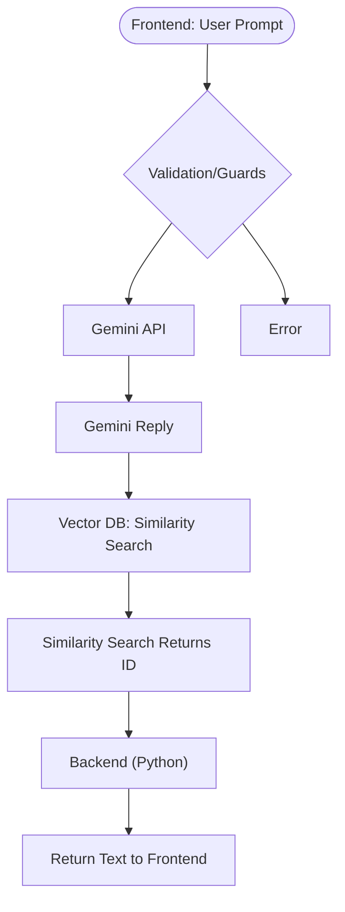

### arch 

```mermaid
flowchart TD
    A(["Frontend: User Prompt"]) --> B{"Validation/Guards"}
    B --> C["Gemini API"]
    B --> n1["Error"]
    C --> D["Gemini Reply"]
    D --> E["Vector DB: Similarity Search"]
    E --> F["Similarity Search Returns ID"]
    F --> G["Backend (Python)"]
    G --> H["Return Text to Frontend"]
```